# Union Density & Economic Indicators

#### Team: Anna Kantor, Elizabeth Conway, Matthew Berry, Renuka Kafle, Simon Xu, & Tricia Harris

#### 02/06/2021

## Key Objective & Hypothesis:

### Objective:

- Analyze the relationship between labor union density and several important economic indicators within the countries of the OECD from 2009 - 2018.

### Core Hypothesis:

- Countries with higher levels of union density will have lower levels of income inequality.

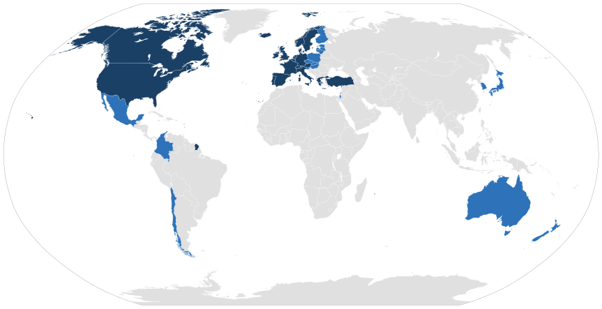

## Motivations

- Over the last forty years the legal and political climate in the United States has become very hostile to labor unions.
- The driving theory behind this trend is the belief among many policy makers that unions hinder economic growth.
- The primary motivation behind this project is to analyze what sort of effects union density has on various economic indicators.

## Questions

> - What impact does union membership have on income inequality in the countries of the OECD?
> - Is there a correlation between union density and the value of a country’s currency?
> - Does the distribution of government spending have an impact on union density?
> - How does the political and legal environment within each country affect income inequality?
> - Identify the Labor Markets demographics.
> - Does Union have effects on wage gap?

## Questions: What is the relationship between union density and income inequality within the countries of the OECD?

### Data Needed:

- Information regarding “union density” in OECD countries
  - “Trade union density” expresses union membership as a proportion of the eligible workforce
- Information regarding income inequality in OECD countries
  - The Gini coefficient measures the extent to which the distribution of income among individuals or households within an economy deviates from a perfectly equal distribution

### Sources:

- Union Density Data Source: OECD (2021), Trade Union (database), stats.oecd.org
- Gini Coefficient Data Source: OECD (2021), Income Distribution (database), stats.oecd.org

### Analysis:

- When all of the countries of the OECD are included in the analysis there is a moderate negative correlation between union density and income inequality.

## Questions: What is the relationship between union density and income inequality within the countries of the OECD?

img[src*="#picture"] {width: 500px}

[comment]: <> ()

## Gini Coefficient and Union Density by Region

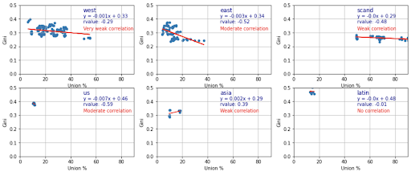

## Latin American Outliers

- As a region, the Gini coefficient of the Latin American countries of the OECD are statistical outliers.
- When the Latin American countries are removed from the dataset the correlation coefficient between union density and Gini coefficient strengthens from -.47 to -.52, i.e. as union density increases the level of income inequality decreases.
  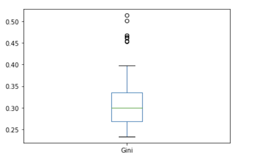

## Gini Coefficient vs. Union Density - OECD

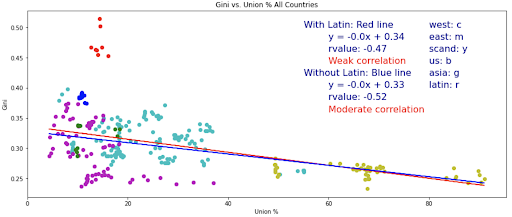

## Questions: Is there a correlation between union density and the value of a country’s currency?

### Note: As the project progressed it appeared to us that CPI & GDP per capita are more relevant economic measures of the effect of the union density on a country’s economy.

### Data Needed:

- Utilized data sources found with the OECD website.

### Sources:

- Data Source
  - CPI Data Source: OECD (2021), Income distribution, OECD Social and Welfare Statistics (database), https://doi.org/10.1787/data-00654-en
  - GDP Data Source: OECD (2021), Gross domestic product (GDP) (indicator). doi: 10.1787/dc2f7aec-en (Accessed on 04 February 2021)

## Union Density vs CPI - all Regions

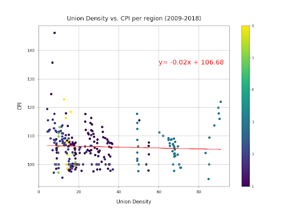

- There appears to be no linear correlation between union density and CPI across the various regions.

- CPI measures changes in costs of living for the majority of consumer goods (food, rent, mortgage, gas, entertainment, etc.). It measures changes in prices year over year.
- The data presented shows that among the 36 countries analyzed, there is there is little variation in CPI regardless of union density.
- CPI is a broad type of measurement, so it’s not necessarily surprising that there is no correlation between CPI and Union Density.
- There is little variation in CPI from one year to the next when looking at the data by year. Perhaps there might be more variation if the time period analyzed was greater, however, there would still likely be no correlation between CPI and Union Density.

## Regional Breakdown

### Union Density vs. CPI per Region

- These graphs show the breakdown per region of the 36 countries, for all years of data. These graphs are intended to zoom in on the various regions before showing as one full graph.
  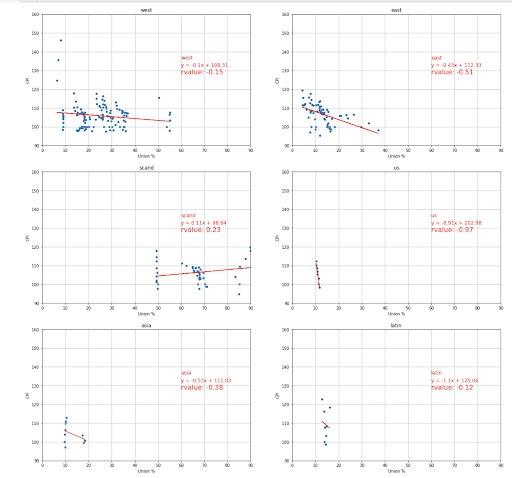

## Union Density vs. GDP

- There is a limited correlation between Union Density and GDP based upon the r value (.36)
  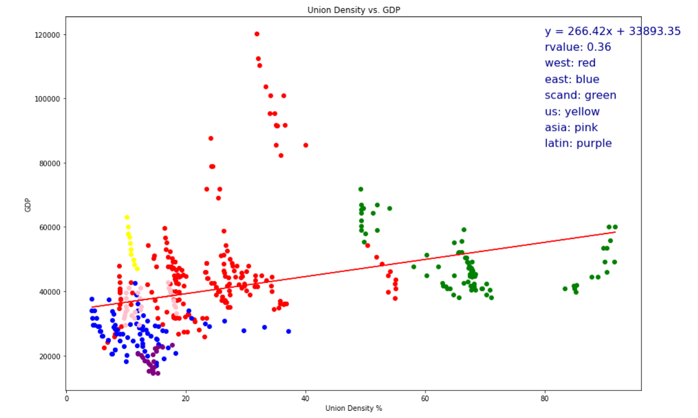

## Union Density v GDP per Capita Without Outliers

- The Union Density IQR is: 22.3
- The GDP IQR is: 15697
- Coefficient of Correlation: .49

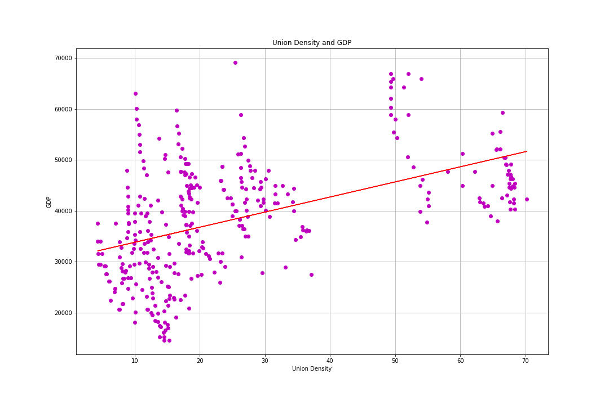

## Questions: Does the distribution of government spending have an impact on union density?

- Data Needed:
  - Summarized government spending by education level.
    - Team pivoted due to limited data sources.
- Sources:
  - OECD (2021), Adult education level (indicator). Doi: 10.1787/36bce3fe-en (Accessed on 05 February 2021)

## All OECD Countries

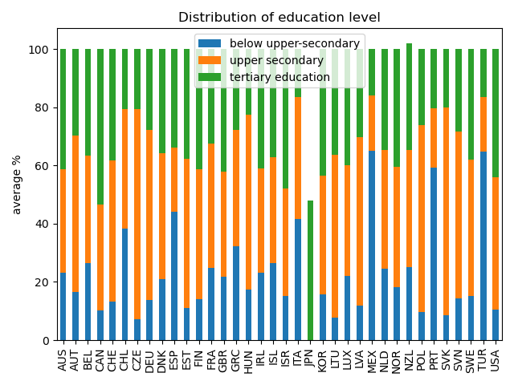

- Analysis:

  - The dataset provides information about
  - three levels: below upper-secondary, upper secondary and tertiary education.
  - The measure is % of same age population.

## All OECD Countries

| Below Upper-Secondary          | Highest Tertiary Level         |
| ------------------------------ | ------------------------------ |
| 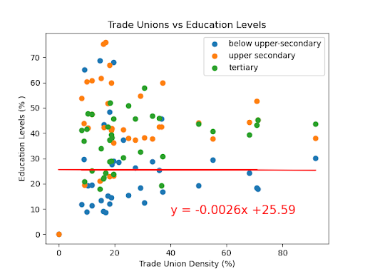 | 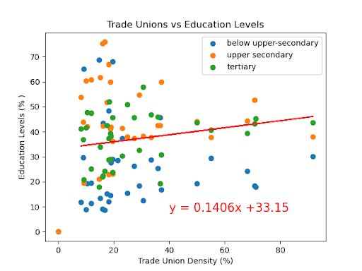 |

## Regional Breakdown

### Union Density vs. GDP per Region

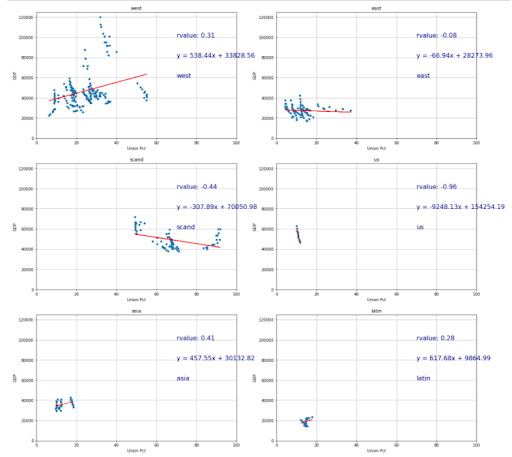

## Questions: How does the political and legal environment within each country affect income inequality?

- Data Needed:
  - A way to delineate how the concept can be measured
    - The ITUC Global Rights Index is based on information recorded in the ITUC Survey, the world’s most comprehensive database on workers’ rights violations. It covers violations in law and in practice
    - Countries are rated on a scale from 1 to 5. A high score effectively means that a large number of violations were committed which in turn results in a poor rating
- Data Source:
  - International Trade Union Confederation
- Analysis:
  - OECD countries where the political and legal systems are more friendly to labor unions tend to have a lower average Gini coefficient. Interestingly, this is not true for the three - countries rated most poorly

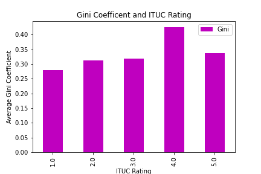

## Questions: What is the average age of the workforce?

- Nominal variance of the workforce population among the regions.
  - Obtain smaller datasets than 18 - 65.
  - Utilized data sources found with the OECD website.
  - Working Age Population Source: OECD (2021), Working age population (indicator). doi: 10.1787/d339918b-en (Accessed on 04 February 2021)

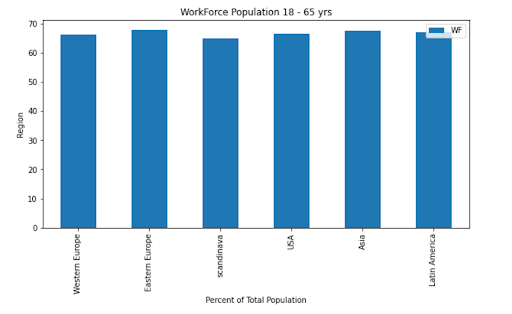

## Questions: What does labor market and wages looks like?

### We used OECD stats database to collect statistics on labor force. Below data were pulled as CSV file.

- Total labor force participation as a percentage of total population.
- Unemployment rate as a percentage of total population.
- The data set containing ratio of low-paid workers compared to median wages was used a measure for wage gap.

##### Data Source: https://stats.oecd.org/

## Labor Force Participation Rate

### The graph shows the average labor participation rate as a percentage of total population across region over 10 years.

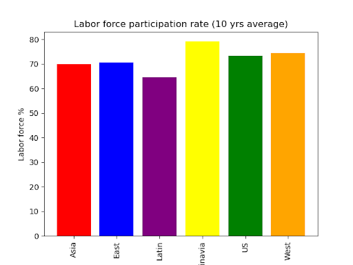

## Unemployment Data

### Unemployment rate as a percentage of total population over 10 years.

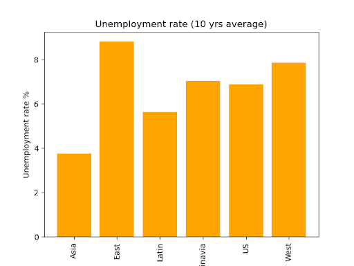

## Does higher union density leads to lower wage gap?

- Wage gap was measured as a percentage
- share of full-time workers earning less than two-thirds of gross median earnings of all full-time workers.

- There is moderate correlation between Union Density and wage gap.

- Countries with higher union density had lesser wage gap.

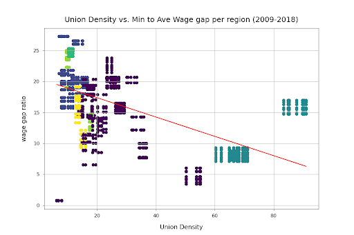

## Data Cleanup & Exploration:

| - Abundance of data required us to maintain focus

- Check each columns by column report
  - Remove redundant columns
  - Remove unrelated columns
- Merge data
  - One dataset has 11 years of Gini and CPI from 2009 ~2019
  - Another has 21 years of union data from 1998 ~ 2018
- Merge rows
  - Gini data and CPI data in different rows
  - Merge the two data to the same row by country and year

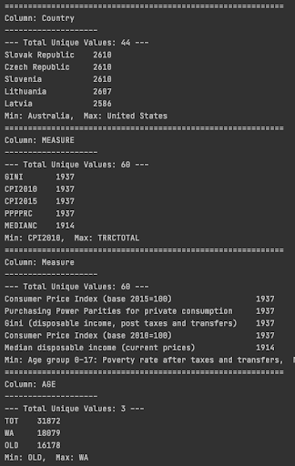

## Conclusions and Implications

- We found a moderate to low correlation between union density and the Gini coefficient, GDP per capita, and wage gap for the countries of the OECD. This suggests that countries with higher union participation have lower levels of income inequality and higher GDP per capita.
  - When statistical outliers are removed the correlation strengthens
- It appears that countries with a political and legal climate that is more accommodating to unions tend to have a lower level of income inequality.
- It appears there is not a significant correlation between union density and a country’s CPI or education level.
- Potential implications for economic and legal policy based on this analysis would include the conclusion that countries wishing to lower income inequality and increase GDP per capita should implement policies and laws that create a favorable legal and political climate for labor unions.

## Resources

### Data

- https://data.oecd.org/gdp/gross-domestic-product-gdp.htm
- Stats.oecd.org
- https://www.ituc-csi.org/
- https://www.ituc-csi.org/IMG/pdf/ituc_globalrightsindex_2020_en.pdf
